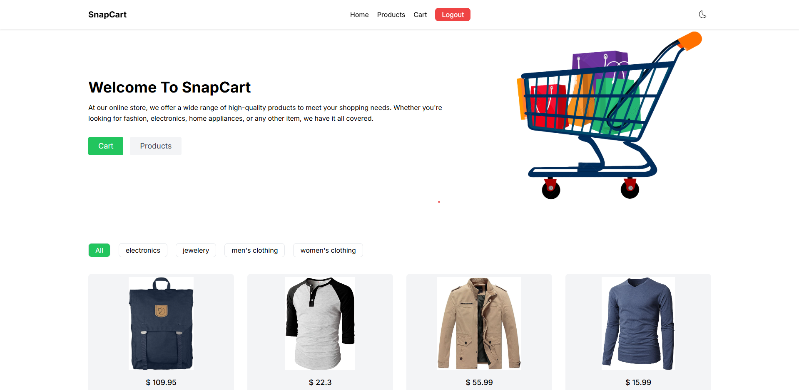

🛒 SnapCart – A Modern MERN E-Commerce Platform

SnapCart is a modern e-commerce platform built using the MERN stack (MongoDB, Express.js, React, Node.js). It provides a seamless shopping experience with intuitive navigation, secure payments via Stripe, and a responsive UI.

🚀 Features
✅ User Authentication – Sign up, log in, and manage your account securely
✅ Product Management – Browse, filter, and view product details
✅ Shopping Cart – Add, remove, and update cart items
✅ Secure Payments – Checkout using Stripe integration
✅ Dark Mode Support – Switch between light and dark themes
✅ Mobile Responsive – Fully optimized for all screen sizes

🏗 Tech Stack
Frontend: React.js, Tailwind CSS
Backend: Node.js, Express.js
Database: MongoDB
Authentication: JWT (JSON Web Token)
Payment Integration: Stripe
🎮 Installation & Setup
1️⃣ Clone the Repository
sh
Copy
Edit
git clone https://github.com/Suhail1102/SnapCart.git
cd SnapCart
2️⃣ Install Dependencies
Backend Setup
sh
Copy
Edit
cd server
npm install
Frontend Setup
sh
Copy
Edit
cd client
npm install
3️⃣ Setup Environment Variables
Create a .env file in the server folder and add:

ini
Copy
Edit
MONGO_URI=your_mongodb_connection_string
STRIPE_KEY=your_stripe_secret_key
ORIGIN=http://localhost:3000
JWT_SECRET=your_jwt_secret_key
▶️ Run the Project
Backend Server
sh
Copy
Edit
cd server
npm start
Frontend Client
sh
Copy
Edit
cd client
npm start
Your app will be live at http://localhost:3000 🎉

🔗 Live Demo
🌐 SnapCart Live

🤝 Contributing
We welcome contributions! Fork the repo, create a branch, make changes, and submit a pull request.

📜 License
This project is MIT Licensed.